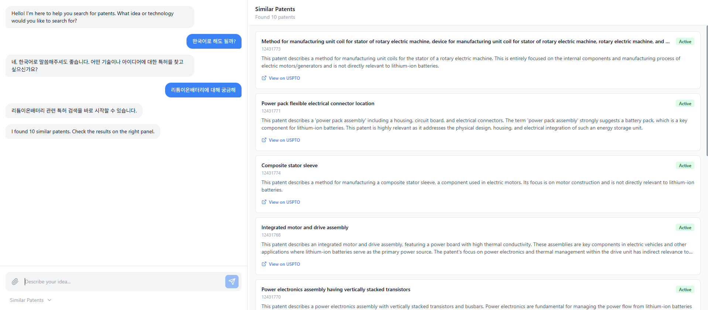
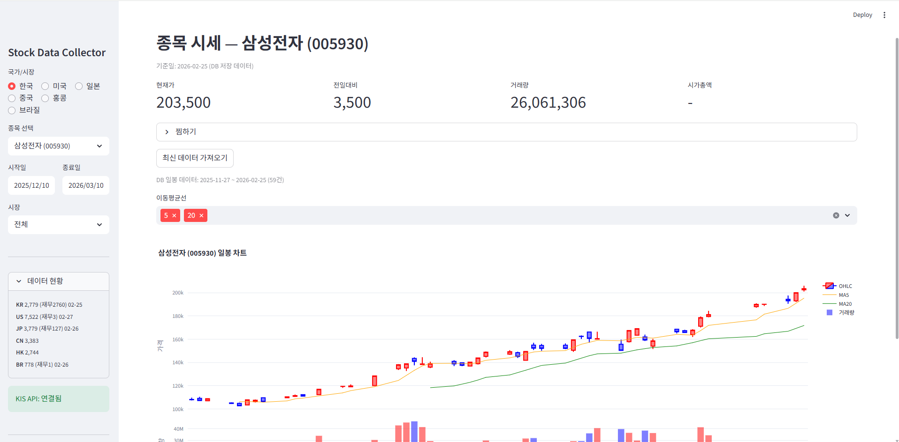
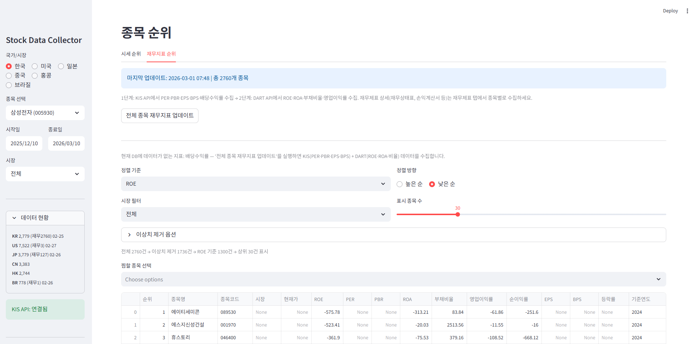

# AI 기반 소프트웨어 개발자

LLM과 벡터 검색을 활용한 AI 검색 시스템, 금융 데이터 분석 도구,
크로스플랫폼 음성 AI 서비스 등 다양한 도메인에서 개발하고 있습니다.

---

### 🛠 Tech Stack

**AI / ML**&nbsp;&nbsp;&nbsp;`Gemini API` `Pinecone` `RAG` `LLM` `Embedding`

**Backend**&nbsp;&nbsp;&nbsp;`Python` `FastAPI`

**Frontend**&nbsp;&nbsp;&nbsp;`Next.js` `React` `JavaScript`

**Infra**&nbsp;&nbsp;&nbsp;`Firebase` `Google Cloud` `Git`

---

### 📂 Projects

| # | 프로젝트 | 설명 | 주요 기술 |
|---|---------|------|----------|
| 01 | **AI 특허 검색 시스템** | LLM + 벡터 검색 기반 시맨틱 특허 검색 엔진. USPTO 특허 데이터를 벡터화하여 의미 기반 검색 구현. 2단계 파이프라인으로 검색 정확도 향상. | Python, Gemini 2.0, Pinecone, RAG |
| 02 | **주식 재무 분석 도구** | 기존 MTS/HTS에 없는 재무제표 기반 분석 서비스. 6개국 시장 지원 (KR/US/JP/CN/HK/BR). PBR, PER, ROE 등 다양한 지표 스크리닝. | Python, KIS API, DART API |
| 03 | **AI 음성 처리 웹 서비스** | 음성 데이터를 AI 기반으로 처리·변환하는 웹 플랫폼. STT/TTS 파이프라인 구축. | Next.js, Firebase, STT/TTS |
| 04-05 | **AI 음성 비서 (크로스플랫폼)** | 모바일 및 PC 환경에서 동작하는 AI 음성 비서. 크로스플랫폼 데이터 동기화. | Next.js, Firebase, React |

---

### 📸 Preview

<b>AI 특허 검색 시스템</b> - 클릭하여 스크린샷 보기

 

<em>LLM 기반 "리튬이온배터리" 유사 특허 검색 결과</em>

<b>주식 재무 분석 도구</b> - 클릭하여 스크린샷 보기

 

<em>삼성전자 종목 시세 및 일봉 차트</em>

 

<em>재무지표 기반 종목 순위 스크리닝</em>

---

### 📫 Contact

프리랜서 개발 의뢰나 협업 제안은 아래로 연락해 주세요.

- **Email** — senghoon403@naver.com
- **GitHub** — [github.com/satsumaemo](https://github.com/satsumaemo)
